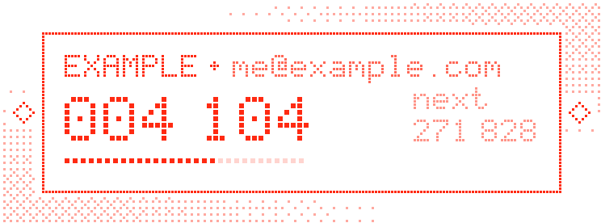

<div align="center">


<br>


<br>

 two-factor codes, made of dots" width="723">

<br><br>


<a href="#install"></a>

</div>

```text
> boot lidar-knight-auth
  codes ........ computed on this device
  network ...... not needed to show a code
  source ....... all of it, in this repository
  upstream ..... Ente Auth (github.com/ente/ente)
> _
```


<h2><a name="what-it-is"></a></h2>

A two-factor authenticator. You add an account by scanning its QR code or typing its setup key, and the app shows a fresh 6-digit code every 30 seconds: the code a site asks for after your password.

It is a re-skinned fork of **Ente Auth**. The engine underneath is Ente's: code generation, encrypted storage and encrypted export. The look is new: every letter, digit and line is built from red dots.

<div align="center">

</div>

- Codes: TOTP (RFC 6238), plus HOTP (RFC 4226) and Steam codes.
- Offline-first: it works with no account and no network.
- Desktop (Windows, Linux, macOS) and mobile (Android, iOS) from one Flutter codebase in [`mobile/apps/auth`](mobile/apps/auth).

<h2><a name="where-it-comes-from"></a></h2>

LiDAR-Knight Auth is a modified fork of **[Ente Auth](https://ente.io/auth)**, the open-source, end-to-end encrypted two-factor authenticator built by **[Ente](https://ente.io)** (Ente Technologies, Inc.).

- Original source: **[github.com/ente/ente](https://github.com/ente/ente)**, in `mobile/apps/auth`.
- Forked at upstream commit `670a770`.
- Code generation, encrypted local storage, encrypted export and the account sync are all Ente's work. Our changes are a red-dot theme, a new name, a dot-matrix font, and turning off Ente's update check (icons still upstream). [Changes from upstream](#changes-from-upstream) has the dated list.

Thank you, Ente, for building a serious authenticator in the open and licensing it so that anyone can study it, change it and share it. If you want the original, with Ente's support and Ente's signed releases, get it from [ente.io/auth](https://ente.io/auth).

> This project is **not affiliated with or endorsed by Ente**. "Ente" and the Ente logo belong to Ente Technologies, Inc. and appear here only for attribution.

<h2><a name="safety"></a></h2>

```text
> how a code is made
  secret (from the QR code) + current 30-second step  ->  HMAC  ->  6 digits
  standard: RFC 6238 (TOTP). the same maths as every other authenticator.
```

**Codes are computed locally.** The app needs the account's secret and your device's clock, nothing else. No server is asked for a code.

**Secrets are stored encrypted.** Without an account ("use without backups"), the codes live in a local database on this device. It is encrypted with a random 256-bit key, and that key is kept in the operating system's secure storage: Keychain on macOS and iOS, Windows' per-user protected storage, the Secret Service keyring on Linux, the Keystore on Android.

**Back up, or lose them.** If that OS key is lost (reinstalling the OS, moving to a new device, restoring an old backup), the codes cannot be recovered. Keep an **encrypted export** (Settings > Data > Export codes, then choose Encrypted). It is protected with a password you choose.

**Desktop builds have their own identity.** On Windows, Linux and macOS this fork uses its own app ID (`io.github.prompdev.lidarknightauth`) and its own data folder, so it can run next to Ente Auth without touching its codes. Two things are still shared: on Windows, one Credential Manager entry (a wrapping key named after the `auth` executable), so do not delete `key_auth_*` entries while either app is installed; and on phones, which still use Ente's IDs (`io.ente.auth`, `io.ente.auth.independent`), so a phone build of this fork cannot sit next to Ente's own. These desktop IDs and folder names will never change after a release: changing them would strand your codes.

**Know what is *not* encrypted.**

- The **plain-text** and **HTML** exports are not encrypted. Anyone who gets the file gets your codes.
- The app lock (PIN, password or biometrics) hides the screen. It does not add another layer of encryption.

**Optional sync is Ente's service.** If you sign in to an Ente account, your codes are encrypted on the device before they are uploaded to Ente's servers (`api.ente.com`). The key comes from your password through Argon2id, and the data is sealed with XChaCha20-Poly1305. Per Ente, the server cannot read your codes, issuers, accounts, tags or notes. That service is run by Ente, under Ente's terms, not by this project.

**Open source, all of it.** Every line that runs is in this repository, under the AGPL-3.0. Read it, build it, compare it with upstream.

**Verify what you run.**

- Desktop builds come from the public workflow [`.github/workflows/lidar-knight-auth-desktop.yml`](.github/workflows/lidar-knight-auth-desktop.yml). Each run's page names the exact commit it built.
- The builds are **not code-signed**, so Windows SmartScreen and macOS Gatekeeper will warn you. That warning is expected.
- If a release lists SHA-256 hashes, check yours: `certutil -hashfile <file> SHA256` on Windows, `sha256sum <file>` on Linux, `shasum -a 256 <file>` on macOS.
- The strongest check: build it yourself from the same commit ([Build](#build)).

**Audits.** Ente's code has been audited externally (Cure53, Symbolic Software, Fallible). Those audits cover **Ente's own releases**, not this fork or its changes.

<h2><a name="what-leaves-the-device"></a></h2>

Upstream Ente Auth makes a few connections even without an account. This fork removes or repoints them. **A box is ticked only once the change is in the code on `main`.** Until it is ticked, the "upstream" column is what the app does.

| Connection | Upstream Ente Auth | This fork |
|---|---|---|
| Showing a code | none | none |
| Service icons | bundled in the app, never fetched | unchanged |
| Update check | on desktop and "independent" Android builds, every launch fetches `ente.com/release-info/auth-independent.json` and offers Ente's binaries | `[x]` disabled (2026-10-04) |
| Crash reports | Sentry at `sentry.ente.io`; opt-in in release builds, on by default in debug builds | `[ ]` remove the endpoint |
| Account, sync, billing | `api.ente.com`, only after you sign in | `[ ]` hide, or keep and label clearly as Ente's service |
| Share-a-code links | `auth.ente.com/share`, only when you share a code | `[ ]` remove or repoint |
| Help, privacy and "source code" links | `ente.com`, `github.com/ente/ente`, only when tapped | `[ ]` repoint to this repository |
| Bug reports and support email | Settings > Support > Report a bug emails your logs to `auth@ente.com`; "Contact support" in error dialogs and on a code that fails to load emails `support@ente.com`; only when you choose to send | `[ ]` repoint to this repository's issues |

**Until that last row is ticked, do not use the in-app "Report a bug" or "Contact support" buttons.** They write to Ente, who do not support this fork. [Report a problem](#report-a-problem) says where to go instead.

<h2><a name="install"></a></h2>

```text
> fetch build
  windows, linux .... Actions > lidar-knight-auth-desktop > latest green run > Artifacts
  macos, mobile ..... no builds yet. build from source.
```

1. Open this repository's **Actions** tab and pick the **lidar-knight-auth-desktop** workflow.
2. Open the latest successful run and download the artifact for your system. GitHub only lets signed-in users download artifacts.
3. **Windows:** unzip it and run the `.exe` inside. Keep the folder together, because the app needs the files next to it.
4. **Linux:** unpack the bundle and run the binary in it. You need a running Secret Service keyring (GNOME Keyring or KWallet), because that is where the encryption key is kept.
5. **Running next to Ente Auth:** fine on desktop (separate IDs and data folders); not possible on phones yet. [Safety](#safety) explains the details.
6. In the app, press **+**, then scan the QR code or type the setup key. The defaults (SHA-1, 6 digits, 30 seconds) are what nearly every site uses.

<h2><a name="build"></a></h2>

You need [Flutter 3.47.2](https://docs.flutter.dev/get-started/install), the version pinned in [`.github/actions/setup-flutter`](.github/actions/setup-flutter/action.yml).

```sh
git clone --filter=blob:none https://github.com/PrompDev/LiDAR-Knight-Auth.git
cd LiDAR-Knight-Auth
git submodule update --init mobile/apps/auth/assets/simple-icons   # the icon pack; the build needs it
cd mobile/apps/auth
flutter pub get --enforce-lockfile

flutter run -d windows            # or: -d linux, -d macos
flutter build windows --release   # -> build/windows/x64/runner/Release
flutter build linux --release     # -> build/linux/x64/release/bundle
flutter build macos --release
flutter run --flavor independent  # Android
flutter run                       # iOS
```

- Clone the **whole** repository, not a sparse part of it. `mobile/` is a Dart pub workspace, and `pub get` expects every member to be present.
- **Windows:** you need Visual Studio with "Desktop development with C++". Run `git config --global core.longpaths true` first, because some paths are deep.
- **Linux:** CI installs `libsecret-1-dev libsodium-dev libfuse2 ninja-build libgtk-3-dev dpkg-dev pkg-config rpm patchelf libsqlite3-dev locate libayatana-appindicator3-dev libffi-dev libtiff5 xz-utils libarchive-tools libcurl4-openssl-dev`. Some of these are only for packaging.
- **Android release:** [set up your own keystore](https://docs.flutter.dev/deployment/android#create-an-upload-keystore), then run `flutter build apk --release --flavor independent`.
- **Packaging: `linux/packaging/*` and `windows/packaging/exe` still carry Ente's identity and AppId; do not use them.** Their `make_config.yaml` files still name Ente as maintainer, vendor or publisher, with Ente's URLs, the package name `enteauth` clashes with Ente's packages, and the Windows installer's AppId is Ente's, so an installer built from it would replace a real Ente Auth install. The same goes for `scripts/build_windows_installer.ps1`. The desktop workflow uses none of them.

<h2><a name="report-a-problem"></a></h2>

- **Bugs in this fork:** [open an issue](https://github.com/PrompDev/LiDAR-Knight-Auth/issues).
- **Security problems in this fork:** report them privately through this repository's **Security** tab ("Report a vulnerability"). If that option is not available, open an issue that says only that you have a security report, with no details, and we will reach out.
- **Do not send this fork's bugs to Ente.** That includes the in-app "Report a bug" and "Contact support" buttons, which still email Ente (see [What leaves the device](#what-leaves-the-device)). If an issue needs logs, attach them to the issue yourself and remove anything private first. The root [`SECURITY.md`](SECURITY.md) is Ente's upstream policy and covers Ente's own releases.
- If you can reproduce a problem in the **official** Ente Auth, it belongs upstream, at [github.com/ente/ente](https://github.com/ente/ente).

<h2><a name="credits"></a></h2>

- **[Ente](https://ente.io)**: Ente Auth, the app this is built on. AGPL-3.0. [github.com/ente/ente](https://github.com/ente/ente)
- **[simple-icons](https://github.com/simple-icons/simple-icons)**: the service icon pack (CC0), included as a submodule.
- **[Doto](https://fonts.google.com/specimen/Doto)** by Óliver Lalan: the dot-matrix typeface bundled in [`mobile/apps/auth/assets/fonts/doto`](mobile/apps/auth/assets/fonts/doto) (SIL Open Font License 1.1; licence file alongside).
- **[Inter](https://rsms.me/inter/)** by Rasmus Andersson: the upstream UI font (SIL Open Font License 1.1).
- **[Flutter](https://flutter.dev)** and every package in `mobile/pubspec.lock`, each under its own licence.
- The dot-matrix art in this README comes from a small script in [`lidar-knight/`](lidar-knight). It uses no external fonts or images.

<h2><a name="license"></a></h2>

**GNU Affero General Public License v3.0**, the same licence as the original. See [`LICENSE`](LICENSE), which is unchanged from upstream.

- **Source:** the complete source for every build is in this repository. If you distribute a modified build, you must offer its source too, under the same licence.
- **No warranty:** the software comes with no warranty, to the extent permitted by law (AGPL-3.0 sections 15 and 16).
- [Read the licence on gnu.org](https://www.gnu.org/licenses/agpl-3.0.html)

<h2><a name="changes-from-upstream"></a></h2>

This is the notice of modifications that the AGPL asks for (section 5a). For the exact diff, [compare with upstream](https://github.com/ente/ente/compare/main...PrompDev:LiDAR-Knight-Auth:main).

| Date | Change |
|---|---|
| 2026-10-04 | Forked [ente/ente](https://github.com/ente/ente) at `670a770`. |
| 2026-10-04 | Replaced this README and `mobile/apps/auth/README.md`. Added `lidar-knight/`, which holds the dot-matrix art generator and its images. |
| 2026-10-04 | New name, "LiDAR-Knight Auth", on every platform's window title, desktop entry and display name; desktop app IDs and data folders are now the fork's own (Windows CompanyName/ProductName, Linux APPLICATION_ID, macOS bundle ID). Phone IDs, data file names and icons are still upstream's. |
| 2026-10-04 | Red-dot theme: red square dots on black, dotted code rows, a dot countdown and dot lettering. |
| 2026-10-04 | Dot-matrix type: the bundled [Doto](https://fonts.google.com/specimen/Doto) font for all text. |
| 2026-10-04 | Translucent desktop window over a dithered red haze. Phones stay opaque. |
| 2026-10-04 | Offline-first welcome screen: "Use without backups" is the main button. |
| 2026-10-04 | Ente's update check turned off. |
| 2026-10-04 | HTML export footer: no remote images, credits Ente Auth, warns that the file is plain text. |
| 2026-10-04 | The lock-screen cover that hides codes is always fully opaque. |
| 2026-10-04 | The onboarding line about security audits now reads "Open source fork of Ente Auth (AGPL-3.0)" in every language. |
| 2026-10-04 | Linux AppStream metadata describes this fork instead of Ente's product. |

The full list of modified files is in [`mobile/apps/auth/CHANGES-LIDAR-KNIGHT.md`](mobile/apps/auth/CHANGES-LIDAR-KNIGHT.md). The remaining connection changes are tracked in [What leaves the device](#what-leaves-the-device).

<h2><a name="the-rest-of-this-repo"></a></h2>

What this fork works on:

- `mobile/apps/auth`, the app
- the shared packages it uses in `mobile/packages`
- `lidar-knight/`, the art
- the desktop build workflow

Everything else is **upstream Ente code**, kept unchanged so the source stays complete and the licence chain stays clear: Photos, Locker, the server, the web apps, the CLI, docs and their workflows. None of it is maintained here. Its READMEs, `CONTRIBUTING.md`, `SUPPORT.md` and `SECURITY.md` speak for Ente, not for this project. For any of it, go to [github.com/ente/ente](https://github.com/ente/ente).


```text
> end of readout ◆
```
